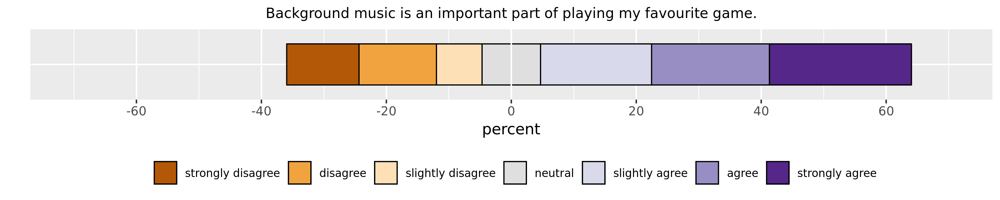
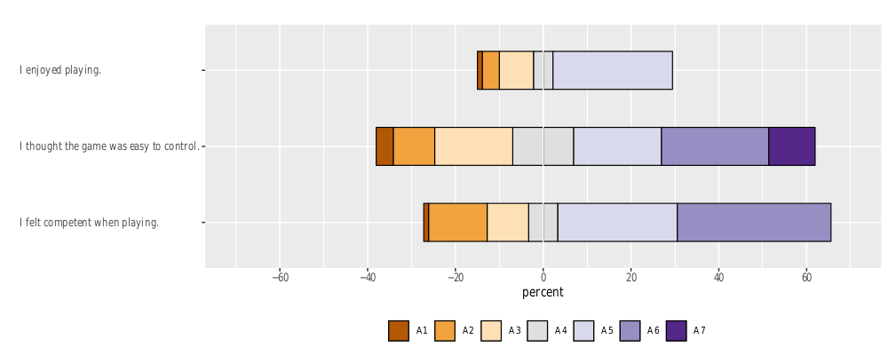

# Rfunctions
Random useful R functions for stats and visualization.

## Stacked horizontal barchart 

Visualize Likert scale responses. 
Individual:

# 

Multiple:
# 

## NumerifyScale.r

Function to turn column with data like "A1" or "Strongly agree" into new numbered column to prep for analysis.

